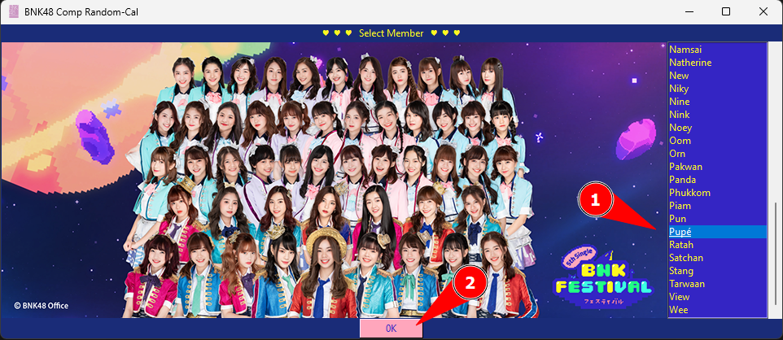
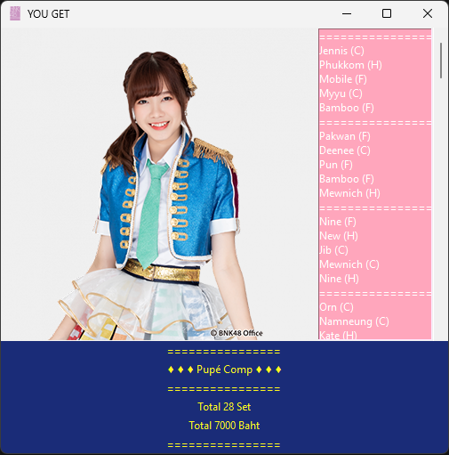

# BNK48 Comp Random Calculator

A program that calculates how many random photo sets of BNK48 you need to buy to complete a complete set of a specific member's photo cards, and estimates the total cost.

## How to Use

1. Run program

```bash
python main_program_v3.py
```

2. Select Member You Want and Press OK



3. The Result Will Show with Details of Cost


